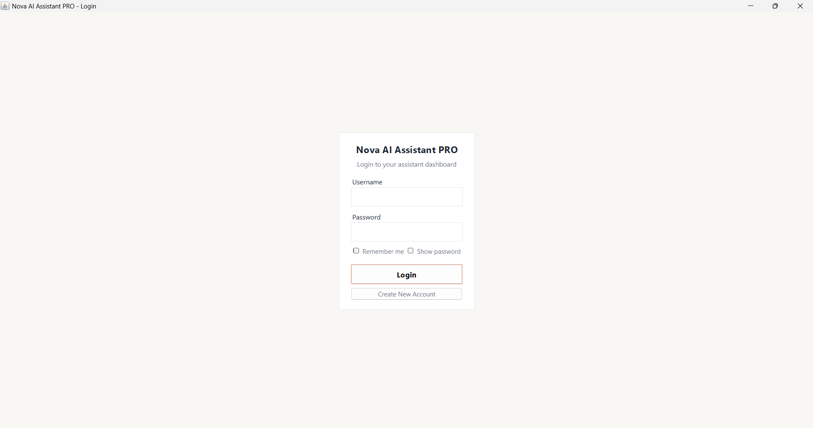
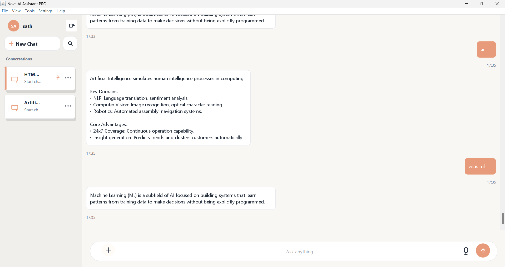
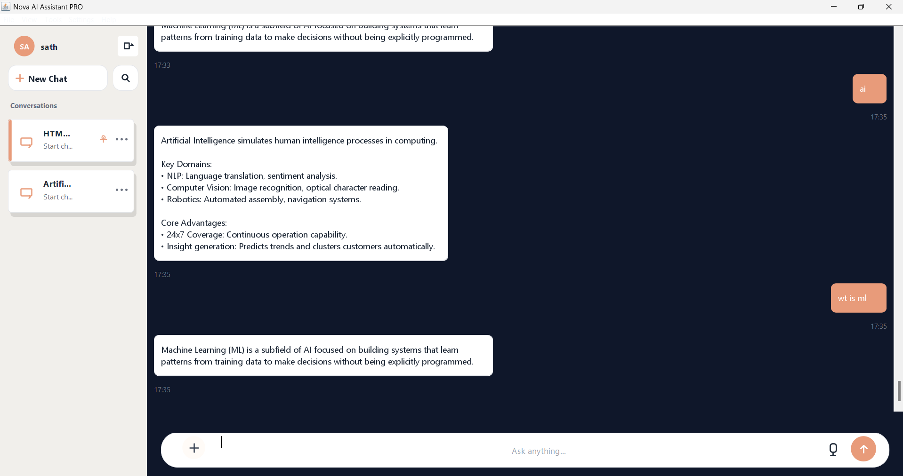
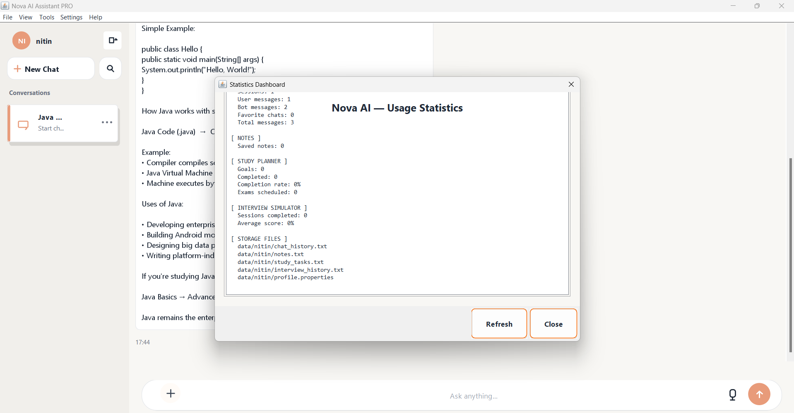
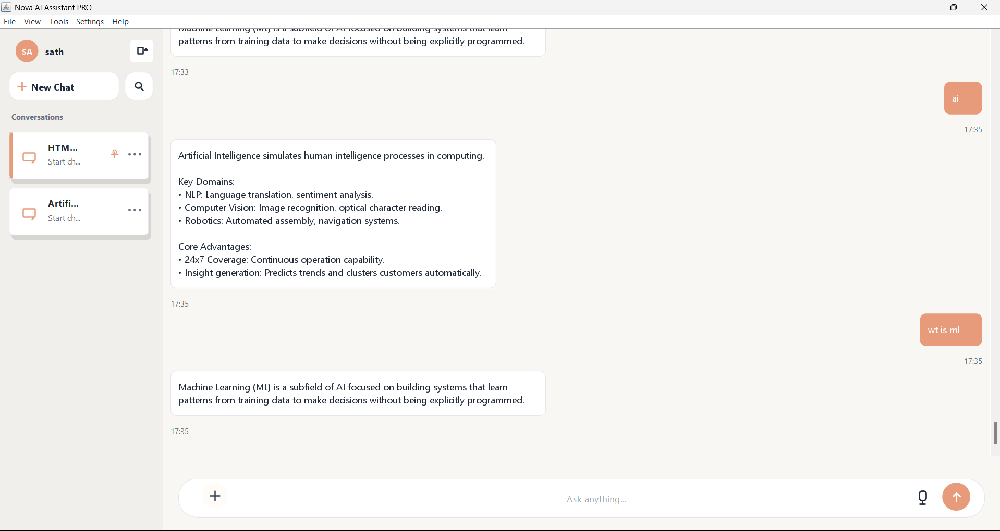
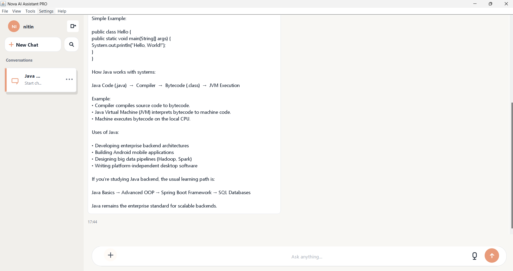

# Nova AI Assistant PRO

[](https://www.oracle.com/java/)
[](https://docs.oracle.com/javase/tutorial/uiswing/)
[](LICENSE)

**Nova AI Assistant PRO** is a portfolio-ready Java Swing desktop assistant built for **CodeAlpha Task 3 (Artificial Intelligence Chatbot)**. It delivers a modern ChatGPT-style experience with multi-session chat, productivity tools, themed UI, and file-based persistence — no external databases or cloud services required.

<p align="center">
  <strong>Chat · Learn · Plan · Practice · Export</strong>
</p>
<p align="center">
  Multi-User Authentication · NLP Intent Detection · Dark Mode · Statistics Dashboard · Resume Builder · Interview Simulator
</p>

---

## Highlights

| Area | Capabilities |
|------|----------------|
| **AI Chat** | Intent recognition, conversation memory, typing indicator, multi-session history |
| **Appearance** | Light, Dark, and Midnight themes with live theme switcher |
| **Productivity** | Notes Manager, Study Planner, Resume Assistant, Interview Simulator |
| **Insights** | Statistics dashboard across chats, notes, goals, and interviews |
| **Data** | Export formatted chats and notes; raw chat backup supported |

---
## Screenshots

### Login Screen



### Main Dashboard



### Dark Mode



### Statistics Dashboard



### Multi-User Support

#### User: Sath



#### User: Nitin



---


## Features

### Core Chatbot

* ChatGPT-like layout with sidebar session list
* New / rename / delete / favorite / search conversations
* User & bot bubbles with timestamps
* Rule-based **AIEngine** with **IntentClassifier**
* **Text Normalization Engine**
* **Intent Scoring System**
* **NLP-Based Intent Detection**
* Categories: Java, Python, C, AI, ML, Data Science, Web, Career, Interview, Resume, and more

### Multi-User Support

* Multi-User Authentication
* User-Isolated Chat Histories
* User-Specific Notes, Tasks, and Settings
* Separate User Profiles and Theme Preferences


### Themes & settings
- **Dark mode** plus **Theme Switcher** (Light · Dark · Midnight)
- **User Settings**: display name, email, theme preference
- Settings persist in each user's profile.properties file.

### Statistics dashboard
- **StatisticsManager** aggregates usage from all local data files
- Chat sessions, messages, notes, study goals, exams, interview scores
- Refreshable detailed text report

### Export
- **Export Chat (Formatted)** — readable transcript by session
- **Export Chat (Raw Backup)** — full `chat_history.txt` copy
- **Export Notes** — all notes to a single `.txt` file

### Built-in tools
- **Resume Assistant** — build & export resume (TXT / PDF)
- **Interview Simulator** — Java, Python, HR modes with scoring
- **Notes Manager** — add, edit, delete, search notes
- **Study Planner** — daily goals, exam countdown, progress bar

### About
- Dedicated **About** dialog with version and feature overview

---

## Tech stack

| Layer | Technology |
|-------|------------|
| Language | Java 8+ |
| UI | Java Swing |
| Storage | Plain text & `.properties` files |
| Build | `javac` (no Maven/Gradle required) |

---

## Project Structure

```text
Main.java
LoginFrame.java
NovaAIFrame.java
ChatPanel.java
MessageBubble.java

AIEngine.java
IntentClassifier.java
IntentScoringEngine.java
TextNormalizer.java
ResponseGenerator.java

ConversationMemory.java
Message.java
ChatSession.java
ChatHistoryData.java

FileStore.java
ThemeManager.java
StatisticsManager.java
UserProfile.java

ResumeAssistant.java
InterviewSimulator.java
NotesManager.java
StudyPlanner.java

RoundedBorder.java
RoundedPanel.java

data/
├─ users.properties
├─ <username>/
│  ├─ chat_history.txt
│  ├─ profile.properties
│  ├─ notes.txt
│  ├─ study_tasks.txt
│  └─ interview_history.txt

Screenshots/
├─ login.png
├─ dashboard.png
├─ dark-mode.png
├─ statistics.png
├─ sath-dashboard.png
└─ nitin-dashboard.png
```


---

## Getting started

### Prerequisites
- [JDK 8](https://www.oracle.com/java/technologies/downloads/) or newer
- Terminal / PowerShell / Command Prompt

### Clone & run

```bash
git clone https://github.com/Sathwikadondapati25/CodeAlpha-AI-Assistant-PRO.git
cd CodeAlpha-AI-Assistant-PRO
javac *.java
java Main
```

1. **Create admin account** on first launch (login screen).
2. Log in and open **Nova AI Assistant PRO**.
3. Use the menu bar: **File**, **View**, **Tools**, **Settings**, **Help**.

---

## Usage guide

### Menu overview

| Menu | Items |
|------|--------|
| **File** | Export Chat (Formatted / Raw), Export Notes |
| **View** | Statistics Dashboard, Theme Switcher |
| **Tools** | Resume Assistant, Interview Simulator, Notes Manager, Study Planner |
| **Settings** | User Settings |
| **Help** | About |

### Theme switcher
Choose **View → Theme Switcher →** Light, Dark, or Midnight. The selection is saved automatically.

### Keyboard tips
- Press **Enter** in the chat input to send a message.
- Double-click a conversation in the sidebar to rename it.

---


## Data Storage

All data is stored locally under `data/` and is isolated per user.

| File / Folder                           | Purpose                                        |
| --------------------------------------- | ---------------------------------------------- |
| `users.properties`                      | Stores registered user credentials             |
| `data/<username>/chat_history.txt`      | User chat sessions and messages                |
| `data/<username>/profile.properties`    | User profile information and theme preferences |
| `data/<username>/notes.txt`             | Notes Manager entries                          |
| `data/<username>/study_tasks.txt`       | Study Planner goals and exams                  |
| `data/<username>/interview_history.txt` | Interview Simulator results                    |

### Example Structure

```text
data/
├─ users.properties
├─ sath/
│  ├─ chat_history.txt
│  ├─ profile.properties
│  ├─ notes.txt
│  ├─ study_tasks.txt
│  └─ interview_history.txt
└─ nitin/
   ├─ chat_history.txt
   ├─ profile.properties
   ├─ notes.txt
   ├─ study_tasks.txt
   └─ interview_history.txt
```

> **Privacy:** All user data is stored locally on the machine. Data is never transmitted to external servers unless explicitly exported by the user.

---

## Example conversation

```
You:  I am learning Python
Nova: That's great! Python is a beginner-friendly programming language.
      Are you learning it for AI, web development, or automation?

You:  AI
Nova: Excellent choice. Python is the most popular language for AI and Machine Learning.
```

---

## Architecture

```text
┌─────────────┐     ┌──────────────┐     ┌─────────────┐
│  NovaAIFrame │────▶│   AIEngine   │────▶│ IntentClassifier │
└──────┬──────┘     └──────────────┘     └─────────────┘
       │
       ├── FileStore (chat, profile)
       ├── ThemeManager (themes)
       ├── StatisticsManager (dashboard)
       └── Tools: Resume / Interview / Notes / Study
```

---

## Roadmap

- [ ] Advanced NLP Scoring
- [ ] Context-Aware Responses
- [ ] AI API Integration (Gemini/OpenRouter)
- [ ] Packaged .jar / installer for Windows & macOS


---

## Contributing

1. Fork the repository  
2. Create a feature branch: `git checkout -b feature/my-feature`  
3. Commit changes: `git commit -m "Add my feature"`  
4. Push and open a Pull Request  

---

## License

This project is released under the **MIT License**. See [LICENSE](LICENSE) for details.

---


## Project Purpose

Built as part of CodeAlpha Internship Task 3 (Artificial Intelligence Chatbot).

This project demonstrates Java Swing development, NLP-based intent detection, multi-user architecture, file-based persistence, and desktop application design.
